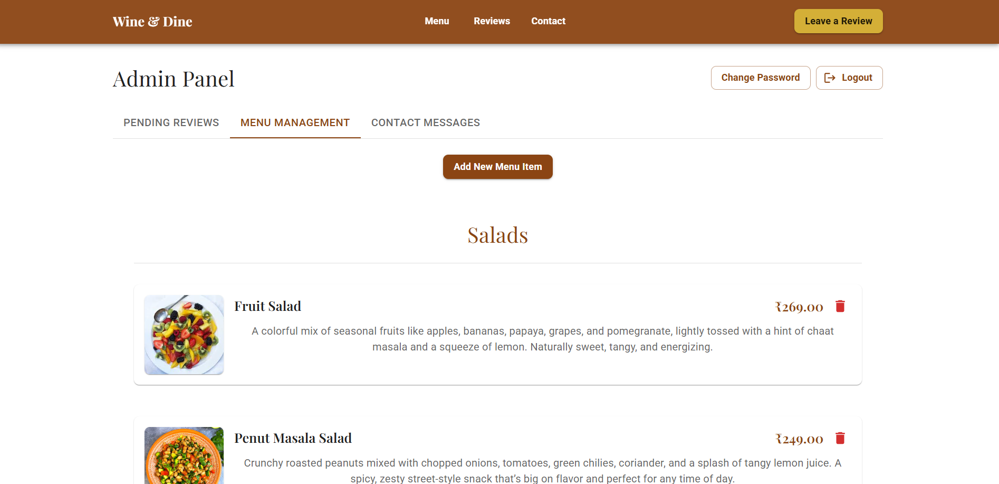

# 🍷 Wine & Dine Restaurant Website


A sophisticated and modern restaurant website built with React and Material-UI, offering an elegant dining experience through a beautiful digital interface.


## ✨ Features

### 🍽️ Public Features
- **Interactive Menu System**
  - Categorized menu items
  - Advanced search functionality
  - Beautiful image gallery
  - Responsive grid layout
  - Real-time price updates

- **Customer Experience**
  - Customer reviews and ratings
  - Interactive reservation system
  - Contact form with real-time validation
  - Location and hours information
  - Special events calendar

### 👨‍💼 Admin Features
- **Secure Dashboard**
  - Protected admin routes
  - Real-time analytics
  - User management
  - Content management system

- **Menu Management**
  - Add/Edit/Delete menu items
  - Category management
  - Image upload and optimization
  - Price and availability control

- **Review Management**
  - Moderate customer reviews
  - Response management
  - Review analytics

## 📸 Screenshots

### 🏠 Home Page

*Elegant landing page showcasing the restaurant's ambiance*

### 📱 Mobile Experience

*Responsive design for mobile devices*

### 🍽️ Menu System

*Interactive menu with categorized items*


*Mobile-optimized menu view*

### 👥 Customer Reviews

*Customer review and rating system*

### 📞 Contact Us

*Contact form and location information*

### 👨‍💼 Admin Dashboard

*Admin menu management interface*


*Review management system*


*Mobile view of admin review management*


*Customer message management system*

## 🛠️ Tech Stack

- **Frontend**
  - React.js
  - Material-UI (MUI)
  - React Router
  - Redux Toolkit
  - Axios

- **Backend**
  - Node.js
  - Express.js
  - MongoDB
  - JWT Authentication

- **Deployment**
  - Vercel (Frontend)
  - Render (Backend)
  - MongoDB Atlas

## 🚀 Getting Started

### Prerequisites
- Node.js (v14 or higher)
- npm or yarn
- MongoDB account
- Git

### Installation

1. Clone the repository
```bash
git clone https://github.com/Sarverjii/Wine-Dine.git
cd Wine-Dine
```

2. Install dependencies
```bash
# Install frontend dependencies
npm install

# Install backend dependencies
cd backend
npm install
```

3. Environment Setup
Create a `.env` file in the root directory:
```env
REACT_APP_API_URL=your_backend_url
REACT_APP_GOOGLE_MAPS_API_KEY=your_google_maps_api_key
```

4. Start the development server
```bash
# Start frontend
npm start

# Start backend (in a separate terminal)
cd backend
npm run dev
```

## 📱 Responsive Design

The website is fully responsive and optimized for:
- Desktop computers
- Tablets
- Mobile phones

## 🔒 Security Features

- JWT Authentication
- Protected Routes
- Input Validation
- XSS Protection
- CORS Configuration
- Rate Limiting

## 🎨 Design Features

- Modern and elegant UI
- Consistent color scheme
- Smooth animations
- Intuitive navigation
- Clear typography hierarchy
- Optimized images

## 🤝 Contributing

Contributions are welcome! Please feel free to submit a Pull Request.

1. Fork the repository
2. Create your feature branch (`git checkout -b feature/AmazingFeature`)
3. Commit your changes (`git commit -m 'Add some AmazingFeature'`)
4. Push to the branch (`git push origin feature/AmazingFeature`)
5. Open a Pull Request

## 📄 License

This project is licensed under the MIT License - see the [LICENSE](LICENSE) file for details.

## 👥 Authors

- **Sarverjii** - *Initial work* - [GitHub Profile](https://github.com/Sarverjii)

## 🙏 Acknowledgments

- Material-UI for the component library
- MongoDB for database services
- Vercel for hosting
- All contributors who have helped shape this project

## 📞 Contact

For any queries or support, please reach out to:
- Email: [your-email@example.com]
- LinkedIn: [Your LinkedIn Profile]
- Twitter: [@YourTwitterHandle]

---

⭐️ If you like this project, please give it a star on GitHub!
